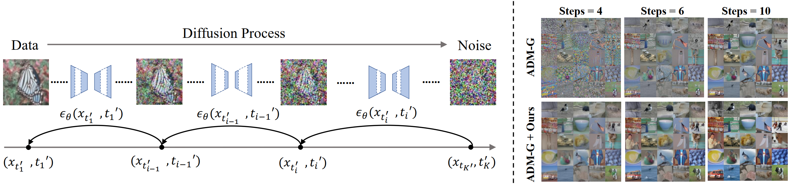

# AutoDiffusion: Training-Free Optimization of Time Steps and Architectures for Automated Diffusion Model Acceleration

The official code of AutoDiffusion proposed by our paper "[AutoDiffusion: Training-Free Optimization of Time Steps and Architectures for Automated Diffusion Model Acceleration](https://arxiv.org/abs/2309.10438)" (ICCV 2023).

**Abstract**:  Diffusion models are emerging expressive generative models, in which a large number of time steps (inference steps) are required for a single image generation. To accelerate such tedious process, reducing steps uniformly is considered as an undisputed principle of diffusion models. We consider that such a uniform assumption is not the optimal solution in practice; i.e., we can find different optimal time steps for different models. Therefore, we propose to search the optimal time steps sequence and compressed model architecture in a unified framework to achieve effective image generation for diffusion models without any further training. Specifically, we first design a unified search space that consists of all possible time steps and various architectures. Then, a two stage evolutionary algorithm is introduced to find the optimal solution in the designed search space. To further accelerate the search process, we employ FID score between generated and real samples to estimate the performance of the sampled examples. As a result, the proposed method is (i).training-free, obtaining the optimal time steps and model architecture without any training process; (ii). orthogonal to most advanced diffusion samplers and can be integrated to gain better sample quality. (iii). generalized, where the searched time steps and architectures can be directly applied on different diffusion models with the same guidance scale. Experimental results show that our method achieves excellent performance by using only a few time steps, e.g. 17.86 FID score on ImageNet 64 $\times$ 64 with only four steps, compared to 138.66 with DDIM.

Figure 1: Left: We propose to search the optimal time steps sequence and corresponding compressed network architecture in a unified framework. Right: Samples by [ADM-G](https://github.com/openai/guided-diffusion) pre-trained on ImageNet 64 $\times$ 64 with and without our methods (AutoDiffusion), varying the number of time steps.
 
 

## Examples
We provide the PyTorch implementation of AutoDiffusion for Guided-Diffusion in `examples/guided_diffusion` and for Stable Diffusion in `examples/Stable Diffusion`.

## Acknowledgment
This repository is built on reusing codes of [Guided-Diffusion](https://github.com/openai/guided-diffusion) and [Stable Diffusion](https://github.com/CompVis/stable-diffusion). 
We recommend using their code repository in your research and reading the [related article](https://arxiv.org/abs/2112.10752).